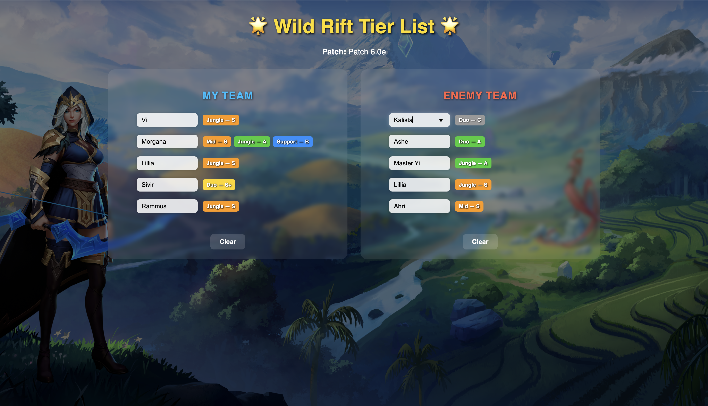

# Wild Rift Tier List Web App

An interactive web tool for comparing champions in **Wild Rift**, using tier data from [wildriftfire.com](https://www.wildriftfire.com/tier-list).



## 💡 Features

- Displays and compares **tiers by role** for both your team and enemy team
- Visual interface with **frosted glass Blur UI**
- Automatic **tier fetching and update** using BeautifulSoup
- Compact inputs and color-coded badges (S+, S, A, B, C)
- Role highlighting for champions with multiple positions
- Built with **Flask** and deployed locally

## 🛠 Tech Stack

- Python 3.11+
- Flask (web backend)
- BeautifulSoup (web scraping)
- HTML + CSS (manual layout)
- JavaScript (dynamic behavior)
- Blur UI (frosted-glass visual style)

## 📁 Project Structure

```
wildrift_tiers/
│
├── static/              # Background image, CSS
├── templates/           # HTML template (index.html)
├── champions.json       # Cached tier data
├── app.py               # Flask app
├── parser.py            # Tier list parser
├── requirements.txt     # Dependencies
└── preview.png          # Screenshot of the UI
```

## 🚀 Getting Started

1. Clone the repo:
```bash
git clone https://github.com/yourusername/wildrift-tiers.git
cd wildrift-tiers
```

2. Create virtual environment and install dependencies:
```bash
python3 -m venv venv
source venv/bin/activate  # or venv\Scripts\activate on Windows
pip install -r requirements.txt
```

3. Run the Flask app:
```bash
python app.py
```

4. Open in your browser:
```
http://127.0.0.1:5000
```

## ✍️ Author

Created by BagautdinovaAN. Inspired by modern game UIs and love for Wild Rift.

